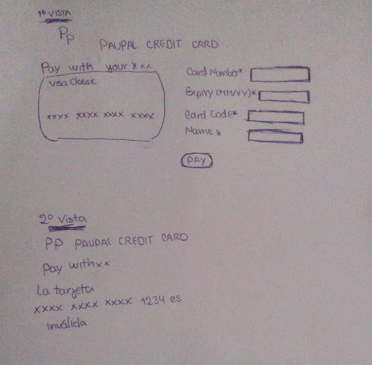

# Tarjeta de crédito válida 

## Índice

* [1. Preámbulo](#1-preámbulo)
* [2. Resumen del proyecto](#2-resumen-del-proyecto)
* [3. Objetivos de aprendizaje](#3-objetivos-de-aprendizaje)
* [4. Consideraciones generales](#4-consideraciones-generales)
* [5. Criterios de aceptación mínimos del proyecto](#5-criterios-de-aceptación-mínimos-del-proyecto)
* [6. Pistas, tips y lecturas complementarias](#6-pistas-tips-y-lecturas-complementarias)

***

## 1. Preámbulo

El [algoritmo de Luhn](https://es.wikipedia.org/wiki/Algoritmo_de_Luhn),
también llamado algoritmo de módulo 10, es un método de suma de verificación,
se utiliza para validar números de identificación; tales como el IMEI de los
celulares, tarjetas de crédito, etc.

Este algoritmo es simple. Obtenemos la reversa del número a verificar (que
solamente contiene dígitos [0-9]); a todos los números que ocupan una posición
par se les debe multiplicar por dos, si este número es mayor o igual a 10,
debemos sumar los dígitos del resultado; el número a verificar será válido si
la suma de sus dígitos finales es un múltiplo de 10.


## 2. Resumen del proyecto

En este proyecto se construye una aplicación web que le permita a un
usuario validar el número de una tarjeta de crédito. Además, se implementa la 
funcionalidad para ocultar todos los dígitos de una tarjeta menos
los últimos cuatro.


## 3. Objetivos de aprendizaje

Construir  una aplicación web  en la que se  interactúa con el usuario final a través del navegador, utilizando HTML, CSS y JavaScript.

### HTML y CSS

* [ ] [Uso de HTML semántico.](https://developer.mozilla.org/en-US/docs/Glossary/Semantics#Semantics_in_HTML)
* [ ] Uso de selectores de CSS.
* [ ] Construir tu aplicación respetando el diseño realizado (maquetación).


### DOM

* [ ] Uso de selectores del DOM.
* [ ] Manejo de eventos del DOM.
* [ ] [Manipulación dinámica del DOM.](https://developer.mozilla.org/es/docs/Referencia_DOM_de_Gecko/Introducci%C3%B3n)
(appendChild |createElement | createTextNode| innerHTML | textContent | etc.)

### JavaScript

* [ ] Manipulación de strings.
* [ ] Uso de condicionales (if-else | switch | operador ternario)
* [ ] Uso de bucles (for | for..in | for..of | while)
* [ ] Uso de funciones (parámetros | argumentos | valor de retorno)
* [ ] Declaración correcta de variables (const & let)

### Testing

* [ ] [Testeo unitario.](https://jestjs.io/docs/es-ES/getting-started)

### Estructura del código y guía de estilo

* [ ] Organizar y dividir el código en módulos (Modularización)
* [ ] Uso de identificadores descriptivos (Nomenclatura | Semántica)
* [ ] Uso de linter (ESLINT)

### Git y GitHub

* [ ] Uso de comandos de git (add | commit | pull | status | push)
* [ ] Manejo de repositorios de GitHub (clone | fork | gh-pages)

### UX

* [ ] Diseñar la aplicación pensando y entendiendo al usuario.
* [ ] Crear prototipos para obtener feedback e iterar.
* [ ] Aplicar los principios de diseño visual (contraste, alineación, jerarquía)


## 4. Consideraciones generales

* El proyecto es individual,cada una aprende a diferente ritmo.
* El proyecto será entregado subiendo tu código a GitHub (commit/push) y la
  interfaz será desplegada usando GitHub pages. 

## 5. Criterios de aceptación mínimos del proyecto

Usa solo caracteres numéricos (dígitos) en la tarjeta a validar [0-9].

### Definición del producto

En el `README.md`, se validó cómo se pensó en los usuarios y cuál fue el proceso
para definir el producto final a nivel de experiencia y de interfaz.

* Quiénes son los principales usuarios de producto.

* Cuáles son los objetivos de estos usuarios en relación con tu producto.

* Cómo crees que el producto que estás creando está resolviendo sus problemas.

### Interfaz de usuario (UI)

La interfaz debe permitir al usuario:

* Insertar el número que queremos validar.
* Ver el resultado si es válido o no.
* Ocultar todos los dígitos de su número de tarjeta menos los últimos
4 caracteres.
* No debe poder ingresar un campo vacío.

### UX (Diseño de experiencia de usuario)

Antes de iniciar a codear, debes entender el problema que quieres solucionar y
cómo tu aplicación lo soluciona.

* Se trabajó el primer prototipo con papel y lápiz (blanco y negro).
* Luego se validó esta solución con una compañera (se pidió feedback).
* Toma lo aprendido al momento de validar tu primer prototipo y desarrolla un
  nuevo prototipo usando alguna herramienta para diseño de prototipos
  ([Balsamiq](https://balsamiq.com/), [Figma](https://www.figma.com/),
  [Google Slides](https://www.google.com/intl/es/slides/about/), etc.)
Estos puntos los presentarás en el `README.md`.

### Scripts / Archivos

#### General

##### `README.md`

Debe contener lo siguiente:

* Título del proyecto: PauPal CREDIT CARD
* Resumen:
En este proyecto se construye una aplicación web que le permita a un
usuario validar el número de una tarjeta de crédito. Además, tendrás que
implementar funcionalidad para ocultar todos los dígitos de una tarjeta menos
los últimos cuatro.
* La imagen final de tu proyecto.


* Investigación UX:
  1. Usuarios y los objetivos en relación con el producto.
    Las tarjetas de crédito se han convertido en una herramienta de pago habitual mayoría de personas y ha cambiado por completo la gestión de las finanzas personales su uso ha aumentado con el paso de los años los usuarios que ha definido son clientes entre 26-50 años,los cuales tienen la capacidad de pedir prestada una cierta cantidad de dinero.

  2. ¿cómo el producto soluciona los problemas/necesidades de dichos
    usuarios?
    Los usuarios esperan la verificación de la validez de la tarjeta de crédito; la verificación de la identidad del usuario; de ser necesario la verificación de la firma del usuario en la orden de pago 
    con la que figura en su tarjeta de crédito,en pocas palabras que la validación de su tarjeta sea segura.
  
  
  3. Primer prototipo en papel.

   
  
  4. Agregar un resumen del feedback recibido indicando las mejoras a realizar.
  Las mejoras a realizar es en el diseño CSS,mejorar la funcionalidad de mis input,pero el proyecto cumple con las condiciones principales del paquetado del proyecto.


  5. Imagen del prototipo final.
   
  


#### Visualmente (HTML y CSS)

Se maquetó de forma exacta el prototipo final con la herramienta
de diseño de prototipos (Figma ) utilizando HTML y CSS. En este momento elegí
los colores, tipo de fuente, etc a usar.

A continuación se describe los archivos que se utilizaron:

##### `src/index.html`

En este archivo va el contenido que se mostrará al usuario (esqueleto HTML).
Encontrarás 3 etiquetas iniciales, las cuales si deseas puedes borrar y empezar
de cero:

* `<header>`: encabezado de tu proyecto.
* `<main>`: contenido principal de tu proyecto.
* `<footer>`: pie de página de tu proyecto.

##### `src/style.css`

Este archivo contiene las reglas de estilo. 

#### Funcionalmente (JavaScript - pruebas unitarias)

* La lógica del proyecto debe estar implementada completamente en JavaScript.
* En este proyecto NO se ha utilizado está librerías o frameworks, sólo JavaScript
puro también conocido como Vanilla JavaScript.
* No se debe utilizó la _pseudo-variable_ `this`.

Se tienen 2 archivos JavaScript separando responsabilidades, a continuación
se indica que se hará en cada archivo:

##### `src/validator.js`

Acá se escribe las funciones necesarias para que el usuario pueda verificar la
tarjeta de crédito y ocultar los dígitos de su número de tarjeta.
Esta función debe ser pura e independiente del DOM.

Para esto debes implementar el **objeto `validator`**, el cual ya se encuentra
_exportado_ en el _boilerplate_. Este objeto (`validator`) contiene
dos métodos (`isValid` y `maskify`):

* **`validator.isValid(creditCardNumber)`**: `creditCardNumber` es un `string`
con el número de tarjeta que se va a verificar. Esta función debe retornar un
`boolean` dependiendo si es válida de acuerdo al [algoritmo de Luhn](https://es.wikipedia.org/wiki/Algoritmo_de_Luhn).

* **`validator.maskify(creditCardNumber)`**: `creditCardNumber` es un `string` con
el número de tarjeta y esta función debe retornar un `string` donde todos menos
los últimos cuatro caracteres sean reemplazados por un numeral (`#`) o 🐱.
Esta función deberá siempre mantener los últimos cuatro caracteres intactos, aún
cuando el `string` sea de menor longitud.

    Ejemplo de uso

    ```js
    maskify('4556364607935616') === '############5616'
    maskify(     '64607935616') ===      '#######5616'
    maskify(               '1') ===                '1'
    maskify(               '')  ===                ''
    ```

##### `src/index.js`

Acá se escribe todo el código que tenga que ver con la interacción del DOM
(seleccionar, actualizar y manipular elementos del DOM y eventos).
Es decir, en este archivo se invoca las funciones `isValid` y `maskify`
según sea necesario para actualizar el resultado en la pantalla (UI).

##### `test/validator.spec.js`

En este archivo se completa  las pruebas unitarias de las funciones
`validator.isValid(creditCardNumber)` y `validator.maskify(creditCardNumber)`
implementadas en `validator.js` utilizando [Jest](https://jestjs.io/es-ES/).
Tus pruebas unitarias deben dar un 70% en _coverage_ (cobertura),
_statements_ (sentencias), _functions_ (funciones) y _lines_ (líneas); y un
mínimo del 50% de _branches_ (ramas).

***

## 6. Pistas, tips y lecturas complementarias

### Primeros pasos

1. Antes que nada, asegúrate de tener un :pencil: editor de texto en
   condiciones, algo como [Atom](https://atom.io/) o
   [Code](https://code.visualstudio.com/).
2. Para ejecutar los comandos a continuación necesitarás una :shell:
   [UNIX Shell](../../topics/shell),
   que es un programita que interpreta líneas de comando (command-line
   interpreter) así como tener [git](../../topics/scm/01-git)
   instalado. Si usas un sistema operativo "UNIX-like", como GNU/Linux o MacOS,
   ya tienes una _shell_ (terminal) instalada por defecto (y probablemente `git`
   también). Si usas Windows puedes usar la versión completa de [Cmder](https://cmder.net/)
   que incluye [Git bash](https://git-scm.com/download/win) y si tienes Windows
   10 o superior puedes usar [Windows Subsystem for Linux](https://docs.microsoft.com/en-us/windows/wsl/install-win10).
3. Una de las integrantes del equipo debe realizar un :fork_and_knife:
   [fork](https://help.github.com/articles/fork-a-repo/) del repo de tu cohort,
   tus _coaches_ te compartirán un _link_ a un repo y te darán acceso de lectura
   en ese repo. La otra integrante del equipo deber hacer un fork **del
   repositorio de su compañera** y
   [configurar](https://gist.github.com/BCasal/026e4c7f5c71418485c1) un `remote`
   hacia el mismo.
4. :arrow_down: [Clona](https://help.github.com/articles/cloning-a-repository/)
   tu *fork* a tu computadora (copia local).
5. 📦 Instala las dependencias del proyecto con el comando `npm install`. Esto
   asume que has instalado [Node.js](https://nodejs.org/) (que incluye [npm](https://docs.npmjs.com/)).
6. Si todo ha ido bien, deberías poder ejecutar las :traffic_light:
   pruebas unitarias (unit tests) con el comando `npm test`.
7. Para ver la interfaz de tu programa en el navegador, usa el comando
   `npm start` para arrancar el servidor web y dirígete a
   `http://localhost:5000` en tu navegador.
8. A codear se ha dicho! :rocket:

### Recursos y temas relacionados

A continuación un video de Michelle que te lleva a través del algoritmo de Luhn
y un par de cosas más que debes saber para resolver este proyecto. ¡Escúchala
con detenimiento y sigue sus consejos! :)

[](https://www.youtube.com/watch?v=f0zL6Ot9y_w)

[Link](https://www.youtube.com/watch?v=f0zL6Ot9y_w)

También una metodología para empezar a desarrollar tareas con JavaScript:

[](https://www.youtube.com/watch?v=lYfEmhLmu7A)

[Link](https://www.youtube.com/watch?v=lYfEmhLmu7A)

Terminal y shell de UNIX:

[](https://www.youtube.com/playlist?list=PLiAEe0-R7u8nGH5TEHfSTeDNIvjZFe_Yd)

[Link](https://www.youtube.com/playlist?list=PLiAEe0-R7u8nGH5TEHfSTeDNIvjZFe_Yd)

Control de versiones y trabajo colaborativo con Git y GitHub:

[](https://www.youtube.com/playlist?list=PLiAEe0-R7u8k9o3PbT3_QdyoBW_RX8rnV)

[Link](https://www.youtube.com/playlist?list=PLiAEe0-R7u8k9o3PbT3_QdyoBW_RX8rnV)

Diseño de experiencia de usuario (User Experience Design):

* Ideación
* Prototipado (sketching)
* Testeo e Iteración

Desarrollo Front-end:

* Valores
* Tipos
* Variables
* Control de flujo
* Tests unitarios
* [Documentación de NPM](https://docs.npmjs.com/)

Organización del Trabajo:

* [Metodologías Ágiles](https://www.youtube.com/watch?v=v3fLx7VHxGM)
* [Scrum en menos de 2 minutos](https://www.youtube.com/watch?v=TRcReyRYIMg)
* [Scrum en Detalle](https://www.youtube.com/watch?v=nOlwF3HRrAY&t=297s). No
  esperamos que hagas todo eso desde este proyecto. Iremos profundizando poco a
  poco a lo largo del -_bootcamp_.
* [Blog: cómo funciona el algoritmo de Luhn](http://www.quobit.mx/asi-funciona-el-algoritmo-de-luhn-para-generar-numeros-de-tarjetas-de-credito.html).
